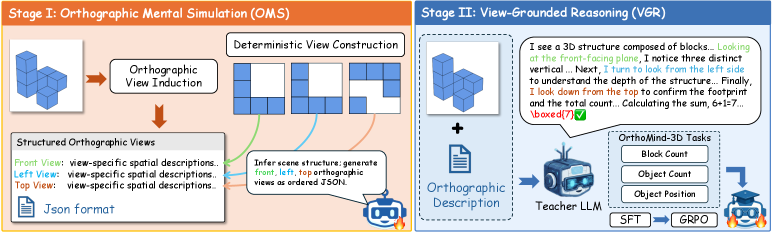
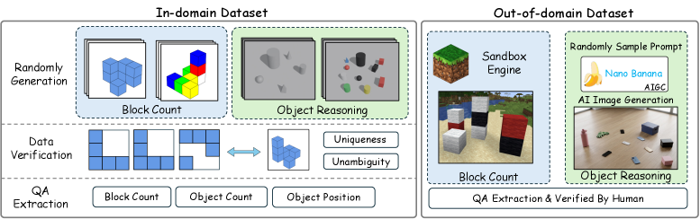

<div align="center">

# 3ViewSense: Spatial and Mental Perspective Reasoning from Orthographic Views in Vision-Language Models

<p>
<a href="https://arxiv.org/abs/2603.07751"></a>
<a href="https://arxiv.org/pdf/2603.07751"></a>
<a href="https://github.com/Jasaxion/3ViewSense"></a>

</p>

Shaoxiong Zhan, Yanlin Lai, Zheng Liu, Hai Lin, Shen Li, Xiaodong Cai, Zijian Lin, Wen Huang, Hai-Tao Zheng

</div>

---

> **TL;DR** — VLMs with Olympiad-level reasoning still fail at *elementary* spatial tasks such as counting occluded blocks. We show this is **not** a weak-encoder problem but a missing **view-consistent spatial interface**. **3ViewSense** teaches a VLM to first *mentally simulate* the canonical orthographic views (front / left / top) of a scene, then *reason* on top of those views — a **Simulate-and-Reason** pipeline that turns a 4B model into a strong spatial reasoner and transfers to five external benchmarks.

## 🧠 Method: The 3ViewSense Framework

Instead of modeling the answer directly from an egocentric image, `P(a | I_ego, q)`, we introduce latent **orthographic views** `V = {v_front, v_left, v_top}` and factorize inference into two steps: **Mental Simulation** (induce the most probable orthographic views from the input) followed by **View-Grounded Reasoning** (answer conditioned on those explicit spatial priors).

<div align="center">

<br>
<em>The three-stage training framework. <b>Stage I (OMS)</b> learns to induce canonical front/left/top views from a single egocentric image. <b>Stage II (VGR)</b> learns to reason by integrating the inferred views into first-person reasoning traces. <b>Stage III (GRPO RL)</b> internalizes and sharpens this view-grounded reasoning.</em>
</div>

| Stage | Name | Objective | What it teaches | Data |
|:-----:|------|-----------|-----------------|:----:|
| **I** | Orthographic Mental Simulation (OMS) | SFT (max-likelihood) | Generate a structured front/left/top view description from one egocentric image | 19.5k |
| **II** | View-Grounded Reasoning (VGR) | SFT on reasoning traces | Solve spatial queries by integrating views in a `front → left → top` order | 21k |
| **III** | Reinforcement Learning | GRPO | Internalize view-grounded reasoning; robustify and reduce reasoning drift | 30k |

**GRPO reward** (Stage III) has two modes: **Strict** (exact match, `R = 𝟙[â = a]`) and **Slack** (distance-graded: counting uses `max(0, 1 − 0.2·|ŷ − y|)`, direction gives `1.0 / 0.5 / 0`). RL must be warm-started from **Stage II (VGR)** — starting from Stage I alone causes training collapse.

## 🗂 OrthoMind-3D Dataset

A diagnostic benchmark for spatial reasoning under occlusion and perspective shifts, with two task families (**block counting** & **object reasoning**) and two streams: **In-Domain** data from programmatic synthesis under strict geometric constraints (a *bijective* mapping between a 3D configuration and its three 2D projections, proven in the paper), and **Out-of-Domain** data from sandbox game engines and generative AI, all manually verified.

<div align="center">

<br>
<em>OrthoMind-3D construction pipeline.</em>
</div>

The full generation pipeline is open-sourced under [`orthomind-3d-synthetic/`](orthomind-3d-synthetic/): `block-count-synthetic/` (layout generation → rendering → dataset → three-view JSON), `object-synthetic/` (geometry/scene generation, Blender rendering, verification), and `ood-image/` (generative photorealistic OOD scenes).

## ⚙️ Installation

```bash
git clone https://github.com/Jasaxion/3ViewSense.git
cd 3ViewSense
pip install -r requirements.txt
```

Training uses vendored backends — install each before running the corresponding stage:
`pip install -e sft-stage/LLaMA-Factory` (Stage I/II) and `pip install -e rl-stage/verl` (Stage III). We build on **Qwen3-VL-4B-Instruct**.

## 🚀 Quick Start

**Data generation** — see [`orthomind-3d-synthetic/`](orthomind-3d-synthetic/) for the full pipeline:

```bash
cd orthomind-3d-synthetic/block-count-synthetic
python Block_gen_large.py --R 3 --C 3 --H 3 --num 100 --output-dir OUTPUT_DIR
python render_block.py --file OUTPUT_DIR/level333/block_solutions.json --num-cases 1000
python build_cube_counting_dataset.py --input-dir OUTPUT_DIR
python build_cube_views_json.py --input-dir OUTPUT_DIR
```

**Training** — three stages in order (details in each stage's README):

```bash
bash sft-stage/OMS-stage/sft-scripts/oms-sft.sh    # Stage I  (OMS SFT)
bash sft-stage/VGR-stage/sft_scripts/vgr-sft.sh    # Stage II (VGR SFT)
bash rl-stage/run_qwen3_vl-4b-slack.sh             # Stage III (GRPO; or *-strict.sh)
```

**Evaluation** — evaluate any VLM on OrthoMind-3D via vLLM / API / local HF ([`evaluation/`](evaluation/)):

```bash
cd evaluation
bash run_spatial_eval.sh /path/to/model                              # vLLM server
PYTHONPATH=.. python eval_vlm.py --model_path /path/to/model --split full   # local HF
PYTHONPATH=.. python eval_vlm_with_api.py --models gpt-4o --split full       # API
```

## 📝 Citation

```bibtex
@article{zhan20263viewsense,
  title={3viewsense: Spatial and mental perspective reasoning from orthographic views in vision-language models},
  author={Zhan, Shaoxiong and Lai, Yanlin and Liu, Zheng and Lin, Hai and Li, Shen and Cai, Xiaodong and Lin, Zijian and Huang, Wen and Zheng, Hai-Tao},
  journal={arXiv preprint arXiv:2603.07751},
  year={2026}
}
```
